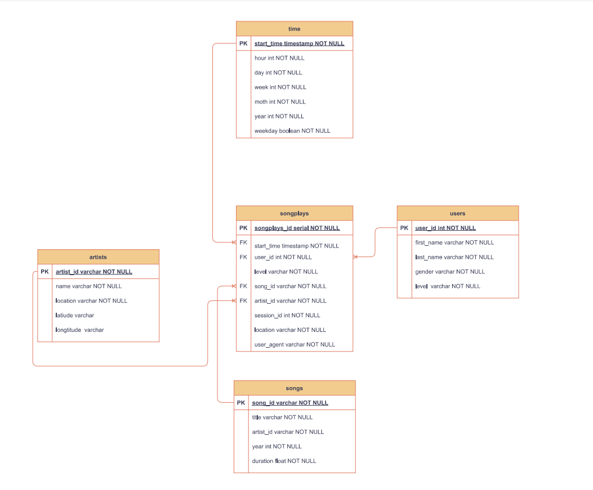

# Introduction 
A music streaming startup, Sparkify, has grown their user base and song database and want to move their processes and data onto the cloud. Their data resides in S3, in a directory of JSON logs on user activity on the app, as well as a directory with JSON metadata on the songs in their app.

This application is building an ETL pipeline that extracts their data from S3, stages them in Redshift, and transforms data into a set of dimensional tables for their analytics team to continue finding insights in what songs their users are listening to.

# Star Schema
This project is designed into start schema.  

# Requirements
In order to run the project, you will need to install below packages:  
<code> pip install boto3</code>  
<code> pip install pandas</code>  
<code> pip install psycopg2 </code> 

# Running Steps: 
1. Set up dwh.cfg under the project path with your own credentials, when you run the code, it will read dwh.cfg automatically.
2. Run **create_tables.py** to create the table, it will drop the table first if the table is existing. 
3. Run **etl.py** to load the data from s3 to redshift. 

